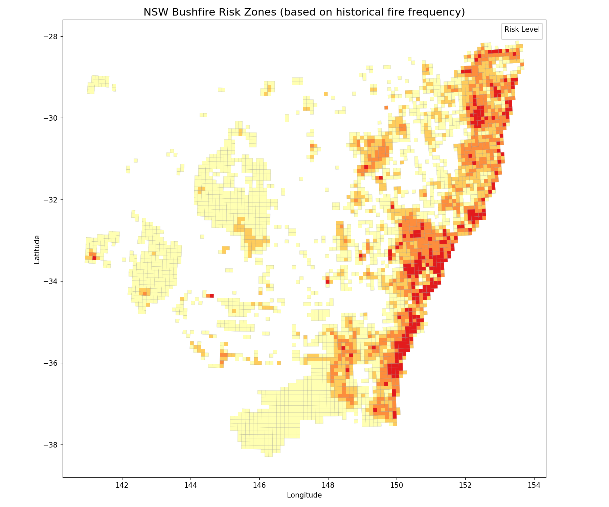
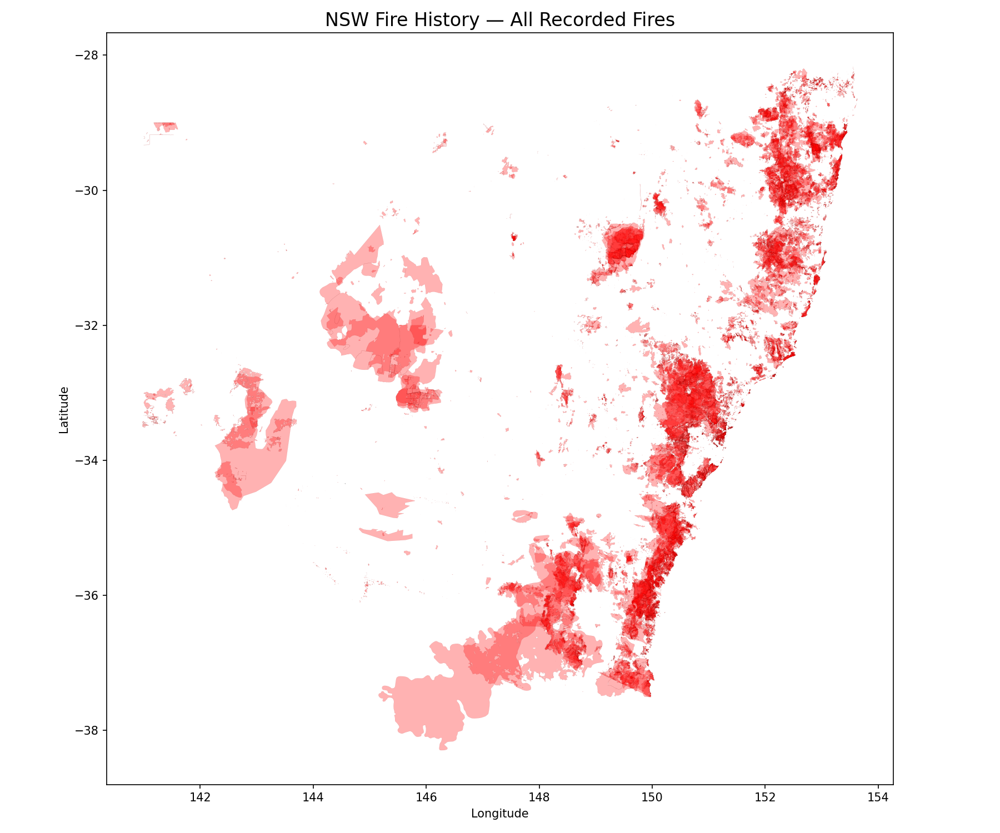

# NSW Bushfire Consequence Model

Most bushfire maps answer "where do fires happen." This one asks the question that actually drives spending: **where do fires threaten people?** It combines 126 years of NSW fire history with population data to find the zones where fire danger and people overlap, not just where fires are frequent.

**Decision this supports:** Prioritising fire-mitigation resources and emergency planning, directing effort to where fire danger and population coincide rather than where fires simply happen most often.

---

## Why I built this

I work in utility infrastructure in Los Angeles, a region that lives with wildfire every year. That experience taught me a fire's true cost is not measured by how often an area burns; it is measured by what is at stake when it does. I built this model to reflect that, using Australian data because I am targeting GIS roles in Australia and NSW faces near-identical fire challenges to California.

## What's different about this project

A frequency map tells you where fires are common. This is a **consequence model**: it multiplies fire frequency by population exposure to surface the zones where danger and people overlap. The output is not "where do fires happen" but "where would a fire hurt the most," which is the question a planner allocating limited mitigation budget actually needs answered.

## Method

1. Loaded 126 years of NSW fire history (37,588 recorded fires, 1900 to 2026).
2. Overlaid a 10 km grid across the state and counted fire occurrences per cell to measure frequency.
3. Overlaid population data (Kontur, 517,000 hexagons) to measure exposure.
4. Combined the two into a consequence score (fire frequency x population) to find zones where danger and people coincide.

## Findings

- **2.6 million people** live in Extreme fire-risk zones in NSW.
- The highest-risk zones are also the most populated: fire danger concentrates exactly where people have built, not in empty bush.
- The consequence model surfaces zones a frequency-only model would miss. One area with only moderate fire history but ~380,000 residents ranks among the top consequence hotspots, invisible on a frequency map.

## Recommendation

Mitigation investment (fuel reduction, evacuation-route planning, asset hardening) should be prioritised at the Sydney metropolitan bushland-urban interface: the northern (Hornsby-Ku-ring-gai), southern (Sutherland), and south-western suburbs where dense population abuts fire-prone bush, plus Greater Newcastle. Notably, the model elevates a moderate-frequency southern-Sydney zone holding ~380,000 residents into the top tier, a hotspot a frequency-only map would overlook but one where the scale of exposed population makes mitigation critical.

## Data sources

| Dataset | Source |
|---|---|
| NSW fire history (1900 to 2026) | NSW NPWS Fire History (open data) |
| Population (517,000 hexagons) | Kontur Population Australia 2023 (open data) |

All open data.

## Limitations / next steps

- The frequency component is backward-looking. A production model would add vegetation and fuel type, slope, fire weather, and proximity-to-asset data.
- Population is residential only, so it does not capture critical infrastructure or daytime and transient populations.
- A natural extension would replace raw frequency with a forward-looking fire-danger surface and overlay socioeconomic data to map consequence vulnerability, not just exposure.

## Tools

Python, GeoPandas, Rasterio, Shapely, Folium, Matplotlib

## Live map

Interactive consequence map: https://transcendent-sable-e6a8a6.netlify.app/nsw_bushfire_consequence.html
