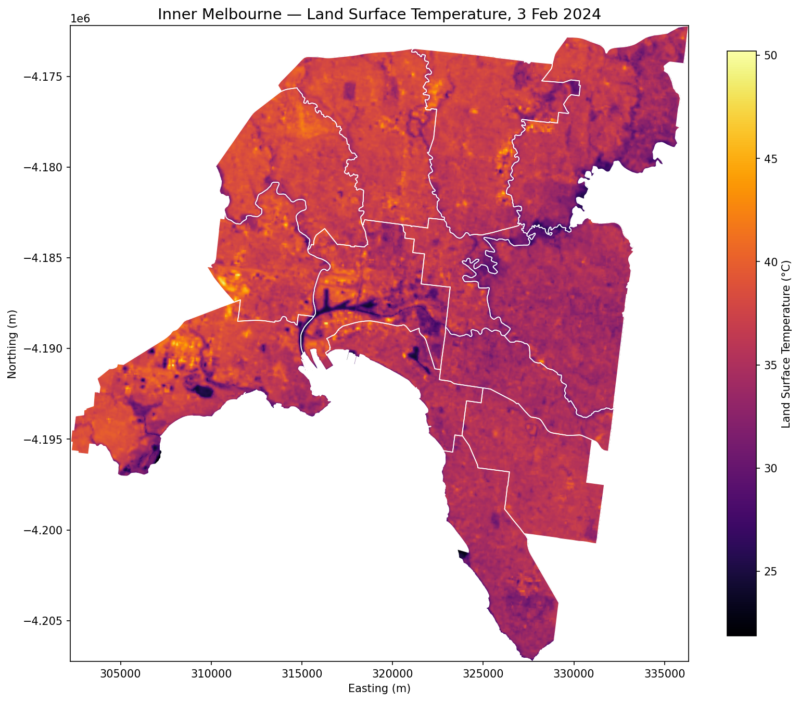
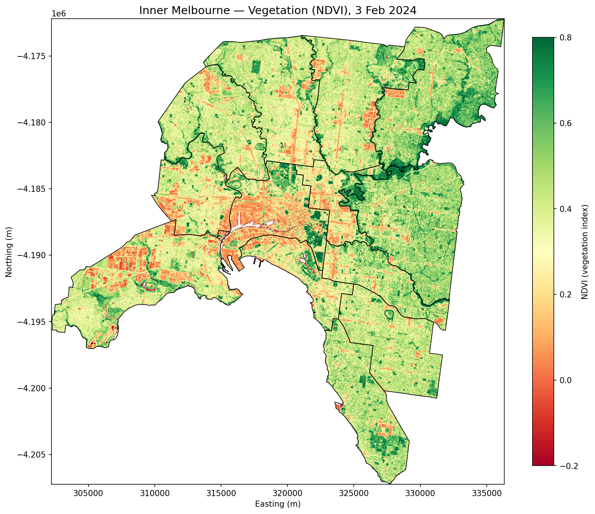
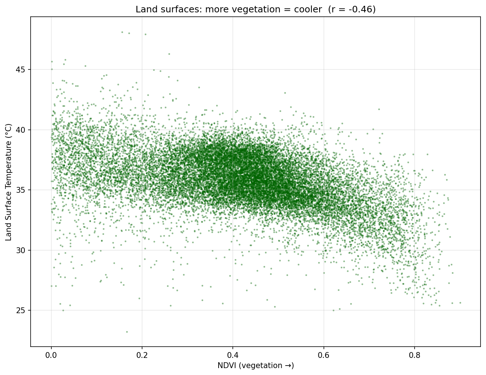

# Melbourne Urban Heat Island Analysis

Mapping land surface temperature across inner Melbourne and testing how strongly it tracks vegetation cover — using a single summer Landsat 9 scene, processed in Python.

**Key finding:** On a summer afternoon, inner Melbourne's councils differ by ~3.5 °C in mean land surface temperature, and the hottest areas are consistently the least vegetated (r = −0.47 across land surfaces). The hottest councils cluster in the industrial northwest; the coolest are the leafy southeast suburbs.

---

## The question

Australian cities are warming, and the urban heat island effect — where built-up areas run hotter than vegetated ones — has direct consequences for health, energy demand, and liveability. Councils need to know *where* heat concentrates and *why*, so cooling investment (tree canopy, reflective surfaces) goes where it matters.

This project asks two questions for inner Melbourne:

1. Which council areas run hottest at the surface?
2. How much of that is explained by a lack of vegetation?

## Data

| Dataset | Source | Use |
|---|---|---|
| Landsat 9 Collection 2 Level-2 (scene LC09_L2SP_092086, 3 Feb 2024) | USGS EarthExplorer | Surface temperature (Band ST_B10) and surface reflectance (Bands 4 & 5) |
| Local Government Area boundaries (ASGS Edition 3, 2021) | Australian Bureau of Statistics | Defining and ranking the 13 inner/middle-Melbourne councils |

All data is open and free. A clear, low-cloud early-February scene was chosen to capture peak summer surface heat.

## Method

1. **Surface temperature** — converted the Level-2 thermal band from scaled integers to °C using the official Collection 2 scaling (`raw × 0.00341802 + 149.0`, then to Celsius), masking off-scene nodata.
2. **Clipping** — reprojected the ABS council boundaries to the scene's CRS (UTM Zone 55S, EPSG:32655) and clipped the raster to the 13-council study area, cutting it from ~60 million pixels to ~1.3 million.
3. **Vegetation (NDVI)** — computed `(NIR − Red) / (NIR + Red)` from the reflectance bands, clamped to the valid [−1, 1] range to remove division artifacts.
4. **Correlation** — measured the pixel-level relationship between NDVI and temperature, masking water (NDVI < 0) so the result describes land surfaces only.
5. **Zonal statistics** — computed mean and maximum surface temperature for each council by clipping the raster to each boundary in turn (implemented directly with `rasterio.mask`, no zonal-stats library).

## Findings

**Surface temperature is strongly patterned by geography.** Across the 13 councils, mean surface temperature ranged from 34.1 °C (Boroondara) to 37.6 °C (Moonee Valley) — a 3.5 °C spread on a single afternoon. The hottest councils (Moonee Valley, Maribyrnong, Moreland) sit in the more industrial, less-vegetated northwest; the coolest (Boroondara, Bayside, Stonnington) are the established leafy southeast.

**Vegetation explains a meaningful share of the variation.** Across land surfaces, NDVI and surface temperature show a moderate negative correlation (**r = −0.47**): greener areas are measurably cooler. The relationship is moderate rather than strong because surface temperature also responds to building materials, moisture, and surface type — vegetation is one major driver among several.

### Council ranking (mean surface temperature, hottest first)

The mean column is the reliable signal; single-pixel maxima are noisier and shown for context only. Full table also in [`outputs/lga_temperature_ranking.csv`](outputs/lga_temperature_ranking.csv).

| Rank | Council (LGA) | Mean Temp (°C) | Max Temp (°C) |
|---|---|---|---|
| 1 | Moonee Valley | 37.59 | 43.87 |
| 2 | Maribyrnong | 37.56 | 48.93 |
| 3 | Moreland | 37.40 | 45.53 |
| 4 | Darebin | 36.65 | 46.54 |
| 5 | Hobsons Bay | 36.52 | 50.21 |
| 6 | Glen Eira | 35.65 | 40.54 |
| 7 | Melbourne | 35.19 | 48.61 |
| 8 | Port Phillip | 35.05 | 46.49 |
| 9 | Yarra | 35.04 | 41.78 |
| 10 | Banyule | 34.72 | 47.37 |
| 11 | Stonnington | 34.47 | 40.98 |
| 12 | Bayside (Vic.) | 34.31 | 40.55 |
| 13 | Boroondara | 34.10 | 45.04 |

## What this is useful for

A council reading this can identify its heat-priority areas and see that low vegetation is a consistent companion of high surface heat — supporting the case for targeted tree-canopy and cool-surface investment in the northwest councils.

## Reproducing

The raw Landsat scene (~940 MB) is **not** included in this repo (see `.gitignore`). To reproduce:

1. Download scene `LC09_L2SP_092086_20240203` (Collection 2 Level-2) from [USGS EarthExplorer](https://earthexplorer.usgs.gov).
2. Download 2021 LGA boundaries (ASGS Edition 3, shapefile) from the ABS.
3. Place them under `data/raw/` and run the notebook in `notebooks/`.

**Tools:** Python · rasterio · geopandas · numpy · matplotlib

## Caveats

- A single-date snapshot (3 Feb 2024), not a multi-year average — it shows one summer afternoon's pattern, not a climatology.
- Surface temperature is not air temperature; satellite-measured surface heat runs hotter than the air temperature a weather station records.
- 30 m Landsat resolution captures neighbourhood-scale patterns, not individual buildings.
