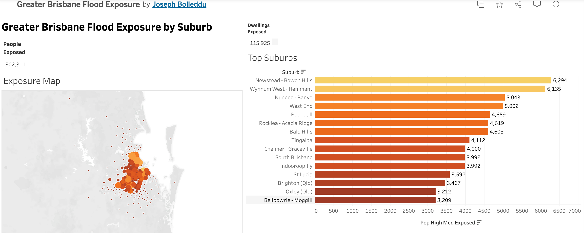

# Greater Brisbane Flood Exposure Dashboard

How many people and homes sit in Brisbane's flood-risk zones — and *where* — turned into an interactive dashboard a council or insurer could act on.

**Decision this supports:** Prioritising flood-resilience investment and emergency planning — identifying which suburbs have the most people and dwellings exposed to high- and medium-likelihood flooding.

**[▶ View the live interactive dashboard on Tableau Public](https://public.tableau.com/app/profile/joseph.bolleddu/viz/GreaterBrisbaneFloodExposure/Dashboard1)**

---

## Why I built this

After the 2011 and 2022 floods, flood exposure is one of the most pressing planning questions in South-East Queensland. A flood hazard map on its own only shows *where water goes* — it doesn't tell a planner *who and what is in the way*. This project joins flood-likelihood mapping to census population and dwelling counts to answer the question that drives investment decisions: which suburbs have the most people and homes exposed, and at what likelihood.

## Key findings

- **~302,000 people and ~116,000 dwellings** across Greater Brisbane sit within mapped flood-risk zones.
- **~118,000 people** are in *high-likelihood* flood zones specifically — and these concentrate in identifiable riverside and bayside suburbs.
- The most-exposed suburbs (by high + medium likelihood population) are **Newstead–Bowen Hills, Wynnum West–Hemmant, Nudgee–Banyo, West End, and Boondall** — all recognisable Brisbane River corridor and bayside areas that flooded in 2011 and/or 2022.
- Like flood risk generally, exposure concentrates where people have built along the river — the highest-risk land is dense, established urban area, not empty floodplain.

## Method

1. **Flood data:** Brisbane City Council "Flood Awareness — Flood Risk Overall" layer (231,445 polygons across creek, river and storm-tide sources), classified into High / Medium / Low / Very Low likelihood. Simplified and dissolved into four clean likelihood zones.
2. **Population & dwellings:** ABS 2021 Census, tables G01 (population) and G37 (occupied private dwellings), at SA2 (suburb) level. Filtered to Greater Brisbane (243 SA2s, ~2.5M people) by spatial selection against the ABS Greater Capital City boundary.
3. **Exposure estimation (areal interpolation):** Each suburb was intersected with the flood zones; population and dwellings were apportioned to each flood category by the fraction of the suburb's area falling in that zone.
4. **Dashboard:** Built in Tableau Public — an exposure point map, a ranked bar chart of the most-exposed suburbs, and headline KPI cards.

## Data sources

| Dataset | Source |
|---|---|
| Flood Awareness — Flood Risk Overall | Brisbane City Council Open Data |
| 2021 Census G01 (population), G37 (dwellings), SA2 | Australian Bureau of Statistics |

All open data.

## Limitations / next steps

- **Areal interpolation assumes population is spread evenly within each suburb.** In reality people and dwellings cluster, so exposure is an estimate, not a building-level count. A production version would use building-footprint or address-point data for precise counts.
- **Likelihood, not depth.** The flood layer gives likelihood categories, not flood depth or velocity — so it identifies *who is exposed*, not *how severe* the impact would be.
- **Occupied private dwellings only** — excludes unoccupied dwellings and non-private dwellings (hotels, etc.).
- A natural extension would overlay socioeconomic indicators to map flood *vulnerability* (exposure × capacity to cope), not just exposure.

## Tools

Python (geopandas, shapely, pandas) for the analysis · Tableau Public for the dashboard.

An alternative interactive version of the exposure map was also built in **folium** (`outputs/brisbane_flood_exposure_map.html`) — same analysis, delivered as a lightweight embeddable web map.
