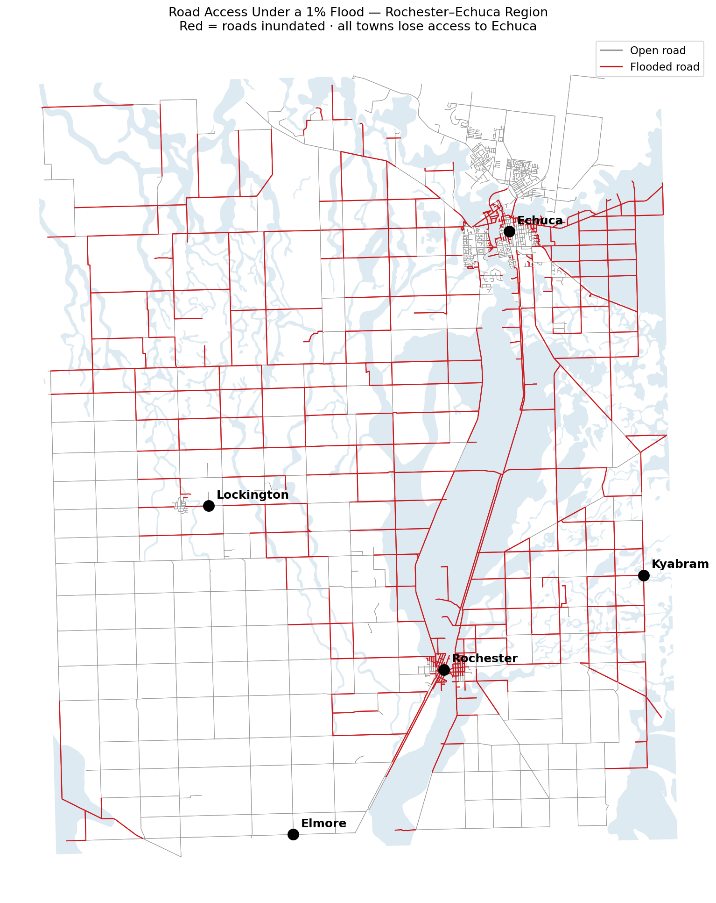
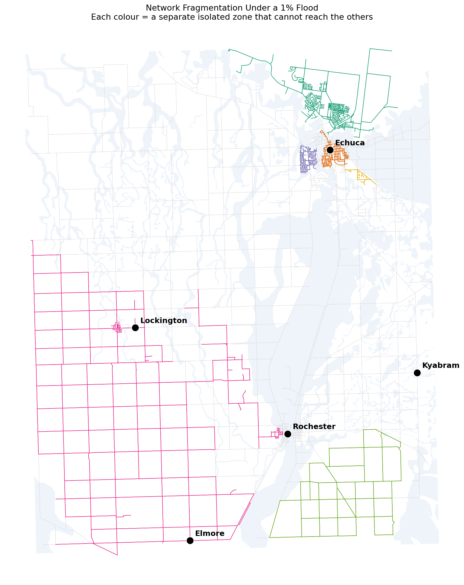

# Victorian Flood Road-Access Analysis — Rochester–Echuca Region

When a major flood hits northern Victoria, which towns lose road access — and how does the road network break apart? This project models the drivable road network of the Rochester–Echuca region and simulates a 1-in-100-year flood to find out.

**Decision this supports:** Prioritising road-resilience investment and emergency planning — identifying which communities lose access in a major flood and where the network's critical weak points are, so second access routes and road-hardening go where they matter most.

---

## Why I built this

In October 2022, Rochester was almost entirely cut off and evacuated when the Campaspe River flooded. Road access across northern Victoria collapsed. A flood hazard map shows where water goes — but for emergency planning and infrastructure investment, the sharper question is *which communities get isolated, and how badly*. That's a road-network connectivity question, not a hazard-mapping one — so this project models the actual road network and tests what happens to it under flood.

## What's different about this project

Unlike a hazard-overlay map, this is a **network analysis**: the road system is modelled as a graph (intersections and road segments), flooded roads are removed, and shortest-path / connectivity algorithms determine which towns can still reach the regional centre and each other. The output isn't "where floods" — it's "who gets isolated."

## Method

1. **Road network:** Pulled the drivable road network for the Rochester–Echuca corridor from OpenStreetMap (via OSMnx) — 2,449 intersections, 6,107 road segments.
2. **Flood layer:** Victoria's 1% AEP (1-in-100-year) flood extent — the same statutory floodplain layer used in Victorian planning-scheme "Land Subject to Inundation" zones.
3. **Flooded roads:** Identified road segments intersecting the flood extent (1,903 of 6,107 segments — 31% of the network).
4. **Connectivity analysis:** Removed flooded segments from the network graph, then computed for each town whether it could still reach Echuca (the regional centre) and the other towns, plus how isolated each town becomes.

## Findings

**All four surrounding towns lose road access to Echuca in a 1% flood.** Rochester, Elmore, Lockington, and Kyabram are each severed from the regional centre when flooded roads are removed.

**The flood fragments the region into isolated pockets.** Rather than simply blocking a few routes, the flood breaks the road network into separate zones that cannot reach one another — Echuca on its own, Elmore and Lockington stranded together, Rochester and Kyabram each severely isolated. In total the network fragments into hundreds of disconnected pieces, with the major towns falling into separate zones.

| Town | Normal route to Echuca | Under 1% flood |
|---|---|---|
| Rochester | 26.9 km | Cut off |
| Elmore | 41.3 km | Cut off |
| Lockington | 31.2 km | Cut off |
| Kyabram | 23.0 km | Cut off |

**This matches the real 2022 event** — the modelled isolation reproduces the access collapse that actually occurred, providing independent validation of the approach.

## Data sources

| Dataset | Source |
|---|---|
| Drivable road network | OpenStreetMap (via OSMnx) |
| 1% AEP flood extent | Victorian Government (DEPI 100-Year Flood Extent), data.gov.au |

Both open data.

## Recommendation

Because every studied town loses its connection to Echuca, road-resilience investment should focus on securing at least one all-weather access route per community — through bridge-raising, road-embankment works, or designated flood-evacuation corridors — rather than spreading effort evenly across the network. The fragmentation result also makes the case for pre-positioning emergency supplies and services within each isolated pocket, since cross-region resupply by road cannot be relied on during a major flood.

## Limitations / next steps

- **"Cut off" is defined at the level of the modelled drivable road network intersecting the flat 2D flood extent.** It does not account for flood depth or timing, temporary causeways, or high-clearance vehicles passing through shallow water — so it identifies network-level isolation, not a guarantee that a town is physically unreachable by any means. A more robust pipeline would intersect the road network with a flood-**depth** raster and remove roads only where depth exceeds a critical threshold (e.g. >0.3 m, where standard vehicles lose traction).
- **The flood extent is a 2014 modelled capture.** The 1% AEP floodplain is a long-term statistical model rather than a single event, so it remains a standard planning reference, but a production analysis would use the latest modelling.
- A natural extension would rank individual road segments and bridges by *criticality* (how many people lose access if that one link fails) to pinpoint the highest-priority resilience investments.

## Tools

Python · OSMnx · NetworkX · GeoPandas · Shapely · Matplotlib
