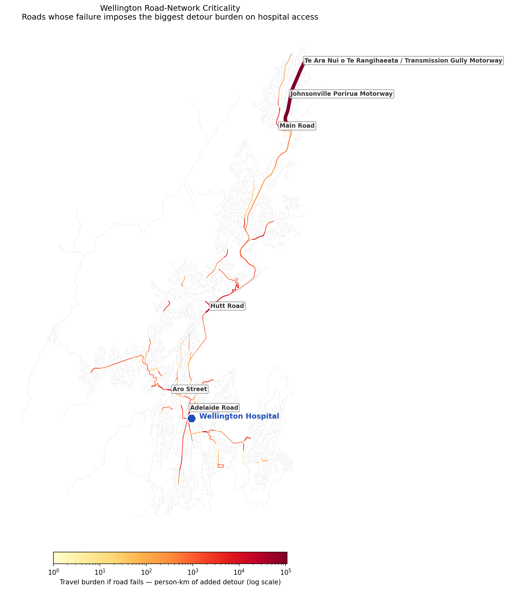

# Wellington Road-Network Criticality - Seismic Access Analysis

Wellington is New Zealand's most earthquake-exposed major city, wedged between the Wellington Fault and the harbour. When a major quake damages the road network, which individual roads matter most? This project ranks Wellington's roads by how badly their failure would degrade the population's access to hospital - pinpointing where seismic-resilience investment should go first.

**Decision this supports:** Prioritising seismic road-resilience investment - identifying the specific roads whose failure would impose the greatest access burden on the population, so bridge-strengthening and route-hardening target the highest-impact links first.

---

## Why I built this

Earthquakes are New Zealand's defining hazard, and Wellington's constrained geography - steep hills, a harbour, and limited corridors - means road access funnels through a small number of routes. After a major quake, the question for emergency planners isn't just "what's damaged" but "which damaged road hurts the most." That's a network-criticality question: of all the roads, which ones, if lost, leave the most people facing the longest detours to essential services.

## What's different about this project

This goes beyond a binary "connected or cut off" analysis. Each major road is removed from the network one at a time, and the impact is measured as the **total extra travel distance the whole population would face** to reach Wellington Hospital - a *detour-weighted* criticality score. A road with a parallel alternative scores near zero; a road that forces tens of thousands of people the long way around scores high. This surfaces a rich gradient of criticality that a simple cut-off test misses.

## Method

1. **Road network:** Pulled Wellington City's drivable road network from OpenStreetMap (OSMnx) - 4,445 intersections, 9,850 road segments, modelled as a graph.
2. **Population:** Assigned 2023 NZ Census usually-resident population (205,035 people across 88 SA2 areas, Stats NZ) to the nearest network node, so the analysis is weighted by where people actually live.
3. **Destination:** Wellington Regional Hospital (Newtown) - the key emergency destination.
4. **Criticality analysis:** For each of the 1,628 major road links (motorway/trunk/primary/secondary), removed it, recomputed every population node's shortest-path distance to the hospital, and measured the population-weighted increase in travel distance (person-km of added detour). Restored the link, moved to the next. Ranked roads by total added burden.

## Findings

**Wellington's major road network is largely redundant - but a handful of roads are disproportionately critical.** Of 1,628 major links tested, only ~700 cause any added travel burden when removed, and the impact is highly concentrated in a few roads:

- **The northern motorway lifeline** (Johnsonville–Porirua Motorway / Transmission Gully) is the single most critical route - there is no genuine alternative for access to/from the north, so its failure forces the largest detours.
- **Adelaide Road** - the main arterial spine through Newtown *to the hospital itself* - carries the highest aggregate criticality across its segments. The road leading to the hospital is itself a key vulnerability for the southern suburbs.
- **Hill-suburb arterials** such as Karori Road and Newlands Road rank high because those suburbs have limited alternative access - losing the one main road in isolates them.

See [`outputs/wellington_road_criticality.csv`](outputs/wellington_road_criticality.csv) for the full ranked list.

## Recommendation

Seismic-hardening investment should be concentrated on the small set of high-criticality roads rather than spread evenly across the network. The clear priorities are the **northern motorway lifeline** (no redundant alternative for northern access) and **Adelaide Road** (the hospital approach serving the southern city), followed by the single-access hill-suburb arterials (Karori, Newlands). Because the network is otherwise redundant, targeted strengthening of these few links delivers far more resilience per dollar than uniform investment.

## Data sources

| Dataset | Source |
|---|---|
| Drivable road network | OpenStreetMap (via OSMnx) |
| 2023 Census usually-resident population by SA2 | Stats NZ |

Both open data.

## Limitations / next steps

- **Criticality is measured to a single destination (Wellington Hospital).** This captures emergency-access resilience specifically; a fuller analysis would measure criticality across multiple destinations (other hospitals, the CBD, lifeline facilities) or network-wide.
- **The person-km figures are indicative, not precise.** Aggregating a road's criticality across its many OSM segments slightly over-counts, since segment burdens are not fully independent. The *ranking* is robust; the exact magnitudes are indicative.
- **Single-link failure.** Real earthquakes damage many links at once. A scenario-based extension would model simultaneous failure of all roads crossing the Wellington Fault rupture zone.
- A natural next step would incorporate bridge and slope-stability data to weight links by their actual likelihood of seismic failure, not just their network importance.

## Tools

Python · OSMnx · NetworkX · GeoPandas · Shapely · Matplotlib
