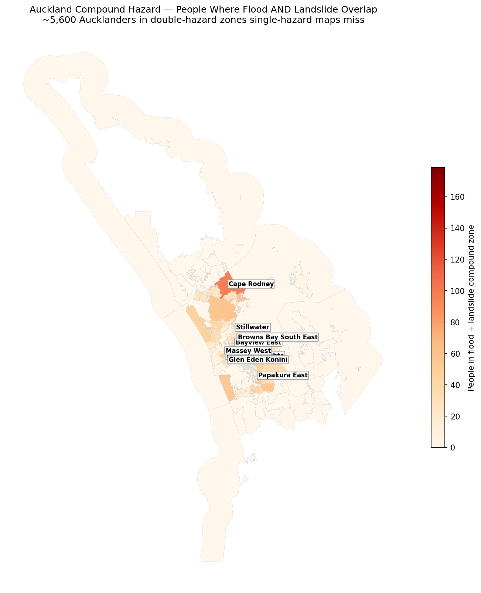

# Auckland Compound Hazard — Flood and Landslide Overlap

Most hazard maps look at one threat at a time. But the 2023 Auckland Anniversary floods and Cyclone Gabrielle hit with *both* flooding and landslides — the latter triggering roughly 50,000 slips across the region, the largest landslide event in New Zealand's history. This project asks a question single-hazard maps can't: **where do flood and landslide risk overlap, and how many people live on that double-jeopardy land?**

**Decision this supports:** Prioritising resilience investment and planning scrutiny for the communities facing *compound* hazard — areas exposed to both flooding and landslides that a flood map alone, or a landslide map alone, would never flag as special.

---

## Why I built this

After 2023, Auckland Council overhauled both its flood maps and (for the first time in almost 30 years) its region-wide landslide susceptibility mapping — both now feed property LIM reports and Plan Change 120 consent rules. But the two hazards are still assessed and mapped *separately*. The places where they coincide — steep gully-streams, hillside drainage paths, valley edges where slopes meet watercourses — are exactly the terrain that failed catastrophically in 2023, yet they fall through the cracks of single-hazard planning. This project overlays the two to find that compound-risk land and the people on it.

## What's different about this project

Where an exposure analysis counts people in *one* hazard zone, this is a **multi-criteria hazard overlay**: it intersects two independent official hazard layers to isolate the compound zone, then estimates the population specifically within that overlap. The output isn't "who's exposed to flooding" — it's "who's exposed to *both*, and so is systematically under-counted by single-hazard mapping."

## Method

1. **Flood layer:** Auckland Council's 1% AEP (1-in-100-year) flood plains — the current, predominantly post-2023 modelling (12,670 polygons), dissolved into a single flood zone.
2. **Landslide layer:** Auckland Council's 2025 region-wide Large-Scale Landslide Susceptibility study (TR2025/7, WSP), pulled via the council's ArcGIS REST API (86,475 polygons). Filtered to High + Very High susceptibility (11,491 polygons) and dissolved.
3. **Compound zone:** Geometric intersection of the flood zone and the high-landslide zone — the land subject to both hazards.
4. **Population:** 2023 NZ Census usually-resident population by SA2 (Stats NZ), estimated into each hazard zone by areal interpolation, filtered to the Auckland region (674 SA2s, ~1.72M people).

## Findings

- **~194,000 Aucklanders** live in the 1% flood zone; **~102,000** live in the high-landslide zone.
- **~5,600 people** live in the **compound zone** where both hazards overlap — a small fraction of either single hazard, because flood-prone land (flat valley floors) and landslide-prone land (steep slopes) are mostly *different* terrain.
- That small overlap is precisely the point: these ~5,600 people are **systematically invisible to single-hazard planning**. A flood map doesn't mark them out; a landslide map doesn't either. Only the overlay reveals them.
- The compound population concentrates in West and North Auckland's hill-and-gully suburbs — Western Heights, Bayview, Massey, Glen Eden, Stillwater, Papakura East — the same steep-slope-meets-watercourse terrain that was hit hardest in 2023.

## Recommendation

The compound zone should be treated as a distinct planning category, not left to fall between two separately-administered hazard layers. The ~5,600 people in West and North Auckland's overlap suburbs warrant prioritised resilience attention — combined flood-and-slope geotechnical assessment, stricter consent scrutiny, and targeted stormwater and slope-stabilisation works — because they face a compounding risk that neither single-hazard map, on its own, makes visible. Overlaying existing official hazard layers is a low-cost way for a council to surface this blind spot from data it already holds.

## Data sources

| Dataset | Source |
|---|---|
| 1% AEP flood plains | Auckland Council Open Data |
| Large-Scale Landslide Susceptibility (TR2025/7, 2025) | Auckland Council / WSP (via ArcGIS REST API) |
| 2023 Census usually-resident population by SA2 | Stats NZ |

All open data.

## Limitations / next steps

- **Population is estimated by areal interpolation**, which assumes people are spread evenly within each SA2 — so the compound-zone figure is an estimate, not a building-level count. A production version would use dasymetric mapping (building footprints / land-use) to sharpen it.
- **Large-scale landslide susceptibility was used; shallow landslide susceptibility is a separate official layer.** Shallow rainfall-triggered slips actually dominated the 2023 event, so a refined version would also overlay the shallow-landslide layer (and could weight the two landslide types differently).
- **Susceptibility is not the same as hazard or risk** — the council's own framing. The landslide layer indicates where slips are *more likely*, not that they will occur.
- A natural extension would add the coastal-inundation layer for a three-hazard compound analysis, and overlay socioeconomic data to map compound *vulnerability*, not just exposure.

## Tools

Python · GeoPandas · Shapely · Matplotlib · requests (ArcGIS REST API)
