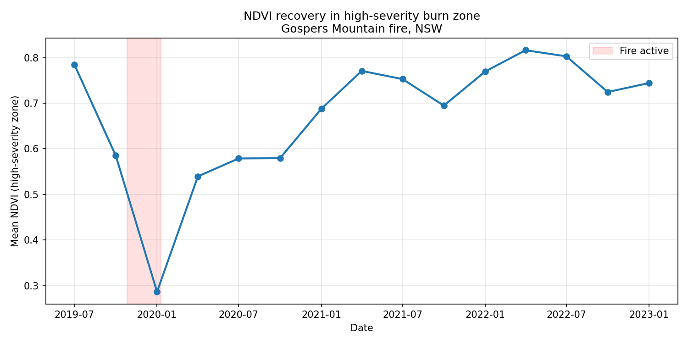

# Post-Fire Vegetation Recovery Monitoring: Gospers Mountain Fire, NSW

Mapping where a megafire burned worst, and how fast vegetation, fuel load and ignition risk grow back, from free satellite imagery.

**The headline:** across the 1,218 km2 high-severity core of the Gospers Mountain fire (27.9% of the study area), green cover crashed 63% at peak impact, then returned to pre-fire levels in about 2.25 years. For a network utility, that two-year window is exactly when vegetation-contact and fuel-load risk under powerlines rebuilds, so it tells you when to tighten inspection and clearance cycles.

## Why it matters

After a megafire, utilities, insurers and councils face the same problem: too much burnt ground, too few crews and dollars to treat it evenly. Blanket-treating the whole scar wastes money on land recovering on its own; ignoring it lets fuel load and vegetation rebuild ignition risk under assets.

This workflow shows which areas are regrowing fast (return-of-risk, re-prioritise inspections) versus recovering slowly (erosion, landslide exposure, active revegetation needed), so post-fire spend is targeted instead of spread thin. It runs on free imagery and reruns on any fire perimeter.

## Key findings

| Moment | NDVI | Read |
| --- | --- | --- |
| Pre-fire (Jul 2019) | 0.78 | Healthy baseline |
| Trough (Jan 2020) | 0.29 | 63% loss of green cover at peak impact |
| First rebound (Apr 2020) | 0.54 | Rapid regrowth, one quarter after containment |
| Recovered (Apr 2022) | 0.82 | Back to pre-fire levels |

- **High-severity zone: 1,218 km2, 27.9% of the study area.** This footprint carries the return-of-risk.
- **Recovery to pre-fire green cover: about 2.25 years (9 quarters).** For a utility, inspection cycles in this zone should tighten well before the two-year mark, not after.
- **Fast first rebound (0.29 to 0.54 in a single quarter):** eucalypt regrowth is vigorous, so fuel load and clearance risk return faster than a naive "recovery takes years" assumption implies.

## Who uses it

- **Network utilities** (Essential Energy, Endeavour Energy in NSW; Vector, Powerco in NZ): re-sequence line-clearance toward fast-regrowth zones near assets. This is the same class of analysis behind utility vegetation and ignition-risk programs, my day-to-day domain.
- **Insurers and reinsurers**: re-rate wildfire risk as fuel load re-accumulates.
- **Councils and consultancies** (Tonkin + Taylor, GHD and similar): target rehabilitation budget to stalled-recovery areas and monitor revegetation against targets.

## How it works

Sentinel-2 imagery on Google Earth Engine, cloud-masked with Cloud Score+. Pre- and post-fire composites produce a dNBR burn-severity map; NDVI tracked quarterly across the high-severity zone produces the recovery curve. Point it at any fire perimeter and it returns the same severity map and recovery trajectory, which makes it a repeatable monitoring layer rather than a one-off study.

Interactive severity map: `outputs/burn_severity_map.html` (download and open in a browser).

Built with the GEE Python API, geemap, pandas and matplotlib. See `postfire_recovery.py` to reproduce.

## Study area

Gospers Mountain fire, Wollemi National Park, NSW. Ignited around 26 October 2019, contained early January 2020, roughly 512,000 hectares burnt: the largest forest fire from a single ignition point in Australian history and a defining Black Summer event.
