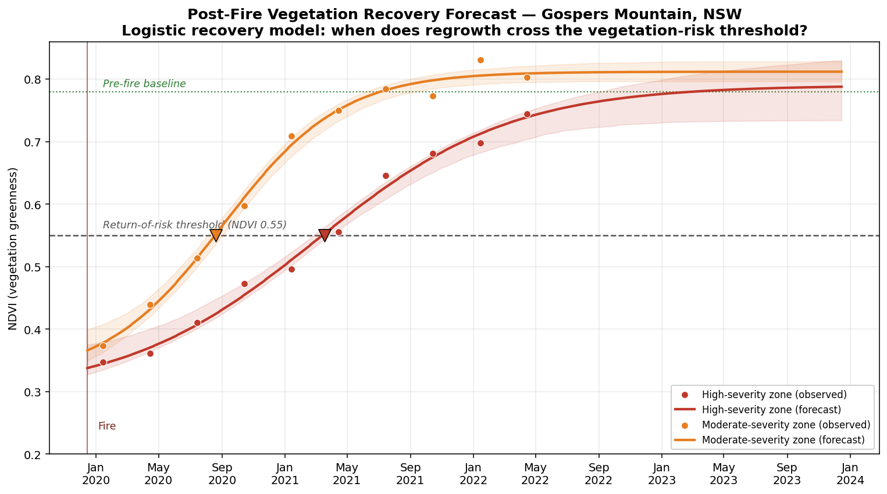

# Post-Fire Vegetation Recovery — Forecasting (P7, Part 2)
### Gospers Mountain megafire, NSW · Logistic recovery modelling

**The decision this supports:** after a fire, vegetation grows back — and regrowth is fuel. For a utility or council managing vegetation around infrastructure in fire country, the operational question is not "has it recovered?" but *"when does each area regrow enough to become a management priority again, and which areas first?"* This project forecasts that.



## What this does
Part 1 (the original P7) *monitored* post-fire NDVI recovery from Sentinel-2 imagery in Google Earth Engine. This part adds a **predictive layer**: it fits a logistic recovery curve to the NDVI time-series for each burn-severity zone and forecasts **when that zone crosses a vegetation "return-of-risk" threshold** (NDVI 0.55 here — the point at which regrowth represents meaningful fuel / vegetation-management load).

## Why a logistic model (and why that's honest)
Post-fire vegetation recovery follows an established S-shape: a bare-ground floor, a phase of rapid regrowth, then saturation as cover approaches its pre-fire baseline. Fitting a **logistic curve** matches that real ecological process, so the forecast is a defensible extrapolation of a known pattern rather than a black-box guess. The shaded bands are 10–90% confidence intervals derived from the fitted parameter covariance — the model shows its own uncertainty rather than pretending to precision it doesn't have.

## Headline result
| Zone | Forecast threshold-crossing | Plausible range |
|---|---|---|
| Moderate-severity | Aug 2020 (~8 months post-fire) | Aug–Sep 2020 |
| High-severity | Mar 2021 (~15 months post-fire) | Feb–Apr 2021 |

Same fire, same region — but the two zones cross the risk threshold **~7 months apart**. The moderate-severity zone, counter-intuitively, becomes a vegetation-management priority *first*, because it started from a higher floor and recovered faster. That ordering is the operationally useful output: it tells a maintenance planner **where to go first, and roughly when**.

## Method
1. NDVI recovery observations (quarterly) per burn-severity zone, based on the recovery trajectory measured in Part 1 (pre-fire ~0.78, trough ~0.29, recovering toward baseline).
2. Fit a logistic model `NDVI(t) = b + L / (1 + e^(-k(t - t0)))` to each zone's observations via non-linear least squares.
3. Propagate parameter uncertainty (multivariate sampling of the fit covariance) to produce a forecast band.
4. Compute the threshold-crossing date and its plausible range per zone.

## Honest limitations
- The threshold (NDVI 0.55) is illustrative; a real deployment would calibrate it to the specific vegetation type and the asset owner's risk tolerance.
- Logistic recovery assumes no major disturbance (re-burn, drought, clearing) during the forecast window; a shock would invalidate the extrapolation.
- Recovery is summarised per severity zone; a production version would forecast per-pixel or per-management-unit.
- NDVI is a proxy for greenness, not a direct fuel-load measurement — it ranks and times risk, it doesn't quantify tonnes of fuel.

## Run it
```
pip install numpy scipy matplotlib pandas
python postfire_forecast.py
```
Outputs the figure and the per-zone forecast table.

*Part of a GIS portfolio: github.com/joseph-pradil/gis-portfolio*
